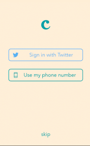

# Cannonball for Android

Cannonball is the fun way to create and share stories and poems on your phone.
Start with a beautiful image from the gallery, then choose words about #romance, #adventure, or #mystery to complete the story and share it with friends.
Browse top stories created by other users for inspiration.

If you just want to use the app,
[install it at Google Play Store](https://play.google.com/store/apps/details?id=io.fabric.samples.cannonball).

## Fabric

This is a canonical sample Android app to demonstrate how to use [Fabric](https://dev.twitter.com/fabric/overview) kits on your mobile apps.

On this app you will find the following Fabric features:

**Fabric initialization** 

Can be found at [App onCreate method](https://github.com/twitterdev/cannonball-android/blob/master/app/src/main/java/io/fabric/samples/cannonball/App.java)

**Twitter Kit**

* [Sign in with Twitter](https://dev.twitter.com/twitter-kit/android/twitter-login) at [LoginActivity](https://github.com/twitterdev/cannonball-android/blob/master/app/src/main/java/io/fabric/samples/cannonball/activity/LoginActivity.java)
* [Search Embedded Timeline](https://dev.twitter.com/twitter-kit/android/show-timelines) at [PoemPopularActivity](https://github.com/twitterdev/cannonball-android/blob/master/app/src/main/java/io/fabric/samples/cannonball/activity/PoemPopularActivity.java)
* [Share](https://dev.twitter.com/twitter-kit/android/compose) at [PoemHistoryActivity](https://github.com/twitterdev/cannonball-android/blob/master/app/src/main/java/io/fabric/samples/cannonball/activity/PoemHistoryActivity.java)
* [Digits](https://dev.twitter.com/twitter-kit/android/digits) at [LoginActivity](https://github.com/twitterdev/cannonball-android/blob/master/app/src/main/java/io/fabric/samples/cannonball/activity/LoginActivity.java)

**Mopub Kit**

* [Native Ads](https://dev.twitter.com/mopub/android/native) at [PoemHistoryActivity](https://github.com/twitterdev/cannonball-android/blob/master/app/src/main/java/io/fabric/samples/cannonball/activity/PoemHistoryActivity.java)

**Crashlytics Kit**

Crashlytics custom logging is spread all around the code, just search for "Crashlytics" in the source code.

* [Crash Reporting](https://dev.twitter.com/crashlytics/crash-reporting)
* [Custom logging](https://dev.twitter.com/crashlytics/android/enhancing-crash-reports) (custom keys, user information, caught exceptions)
* [Beta](https://dev.twitter.com/crashlytics/beta-distribution)
* [Answers](https://dev.twitter.com/crashlytics/answers)

## Building

If you want to run the app locally, do the following:

1. Import the project in your IDE (we use gradle to build)
2. If you don't have a Fabric account
    1. Sign up at fabric.io
	2. Install Fabric IDE plugin
	3. Rename `app/crashlytics.properties.sample` to `app/crashlytics.properties`
    4. Fill in your keys there. Check the [kits page](https://fabric.io/kits) for installation instructions that will include your Fabric keys.
3. If you have a Fabric account
    1. Rename `app/crashlytics.properties.sample` to `app/crashlytics.properties`
    2. Fill in your keys there. Your API key can be found at fabric.io/settings/organizations - click the org you are using, and click to reveal the API key and secret
4. For MoPub, you need to sign up and generate a Ad Unit id.
5. Add that id to `app/crashlytics.properties`
6. Run it

See [how to integrate the SDK](https://docs.fabric.io/android/fabric/integration.html) if you need more help.

## Get support

If you need support to build the app or to understand any part of the code, let us know. Post your question on [Stack Overflow](http://stackoverflow.com/questions/tagged/google-fabric).

## Contributing

The goal of this project is to be an example for Fabric and we strive to keep it simple. We definitely welcome improvements and fixes, but we may not merge every pull request suggested by the community.

The rules for contributing are available at `CONTRIBUTING.md` file.

## Contributors

* [Luis Cipriani](https://twitter.com/lfcipriani)
* [Gareth Jones](https://twitter.com/gpj)
* [Israel Camacho](https://twitter.com/rallat)
* [Ty Smith](https://twitter.com/tsmith)
* [Lien Mamitsuka](https://twitter.com/lientm)
* [Andre Pinter](https://twitter.com/ndform)
* [Chris Aniszczyk](https://twitter.com/cra)
* [Eric Frohnhoefer](https://twitter.com/ericfrohnhoefer)
* [Michael Furtak](https://twitter.com/MikeFurtak)
* [Steve Wilber](http://twitter.com/stevewilber)
* [Dalton Hubble](https://twitter.com/dghubble)

## License

Copyright 2017 Google, Inc and other contributors.

Licensed under the Apache License, Version 2.0: http://www.apache.org/licenses/LICENSE-2.0
